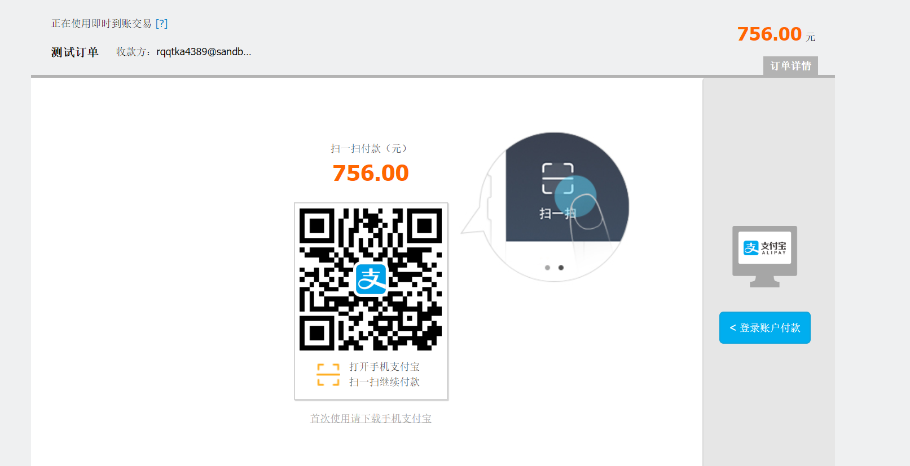

# alipay-demo

用 **github.com/smartwalle/alipay** 第三方apipay的sdk写的沙箱测试小demo, 只是用来做电脑支付(tradePagePay), 同步验证和异步验证.

## 使用方法
```bash
go get github.com/chengjoey/alipay-demo
```
或
```bash
git clone https://github.com/chengjoey/alipay-demo.git
```

修改server.go文件里的支付宝参数

>1. **host** 服务地址域名或ip地址
>2. **appId** 沙箱环境appId或正式环境
>3. **appPrivateKeyFileName** 应用私钥证书地址
>4. **appCertPublicKeyFileName** 应用公钥证书地址
>5. **AliPayRootCertFileName** 支付宝根证书地址
>6. **AliPayPublicCertFileName** 

修改后
```bash
go run server.go
```
或
```bash
go build -mod=vendor
./apipay-demo
```

浏览器打开 **http://{{host}}:5000/pay** 将看到随机生成的金额二维码, 点击[支付宝沙箱版钱包](https://openhome.alipay.com/platform/appDaily.htm?tab=tool)下载并扫码登录沙箱买家账号即可支付, 然后将进行异步验证和同步验证.